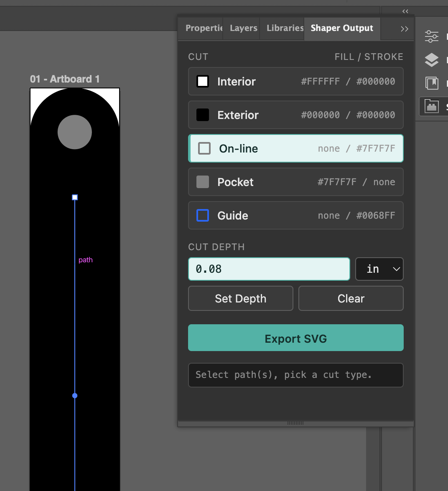

# Shaper Output for Illustrator

An Adobe Illustrator panel that encodes Shaper Origin-compatible `cut-type` settings into SVG paths and exports Shaper-ready files with correct sizing, cut types, and cut depths.

The panel maps Fill and Stroke values to cut types and allows you to set a depth for each cut.



It helps with:

1. **SVG export tuning** — Uses presentation attributes (so fill/stroke are writable), outlines text, uses high coordinate precision, and disables raster mode.
2. **Corrects sizing** — Rewrites the SVG `width` and `height` as explicit physical dimensions (in or mm) relative to the existing `viewBox`, so parts import at true size in Shaper.
3. **Adds Shaper metadata** — Includes `xmlns:shaper`, `shaper:cutType` (mapped from shape colors), and `shaper:cutDepth="<n> <unit>"` on depth-tagged shapes.

Example output:

```xml
<svg width="4in" height="4in" viewBox="0 0 288 288"
     xmlns:shaper="http://www.shapertools.com/namespaces/shaper">
  <rect shaper:cutType="inside" shaper:cutDepth="0.2 in"
        fill="#FFFFFF" stroke="#000000" .../>
```

## Install

Download this package and run `install.sh` in the terminal.
This script:

- Sets the developer mode flag so Illustrator can install self-signed extensions.
- Installs the extension.

After installation, restart Illustrator.
The panel is available at Window > Extensions > Shaper Output

Supports Illustrator 2020+ (`ILST` 24.0+) with CEP/CSXS 9.0 or newer.

## Using

1. Select a path and choose a cut type from the panel.
2. Repeat for each additional path.
3. (Optional) To set a depth, enter a value and unit, then click **Set Depth**. Guides do not use depth values.
4. Click **Export SVG** when ready.

**Export behavior:**
- For `.ai` files, **Export SVG** creates a Shaper-ready SVG copy with the same name next to the .ai file.
- For `.svg` files opened directly in Illustrator, it opens a Save As dialog.

There is a bug in Illustrator around exporting SVGs, so Save As... is used as a workaround.

**About depth values:** Illustrator's standard Save/Export preserves cut-type colors but cannot write custom properties like `shaper:cutDepth`. Any path with a depth value must use **Export SVG**. Paths without depth can export normally through Illustrator.

## Links

- Shaper cut-type encoding: https://support.shapertools.com/hc/en-us/articles/115002721473
- Manual SVG cut-depth encoding: https://support.shapertools.com/hc/en-us/articles/12946815194011

## License

MIT — see [LICENSE](LICENSE). Bundles Adobe's `CSInterface.js` (BSD-licensed), unmodified.
